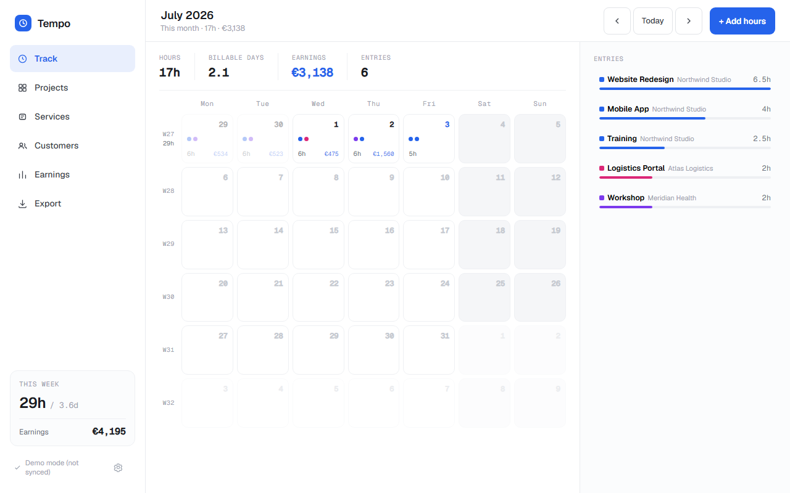
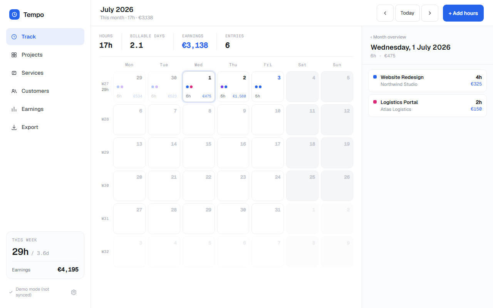
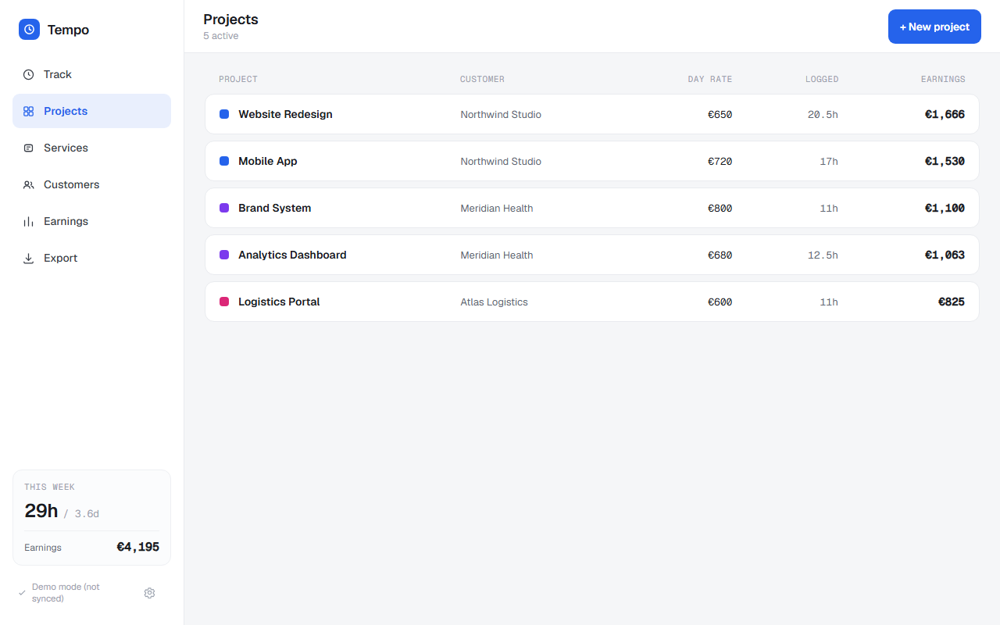
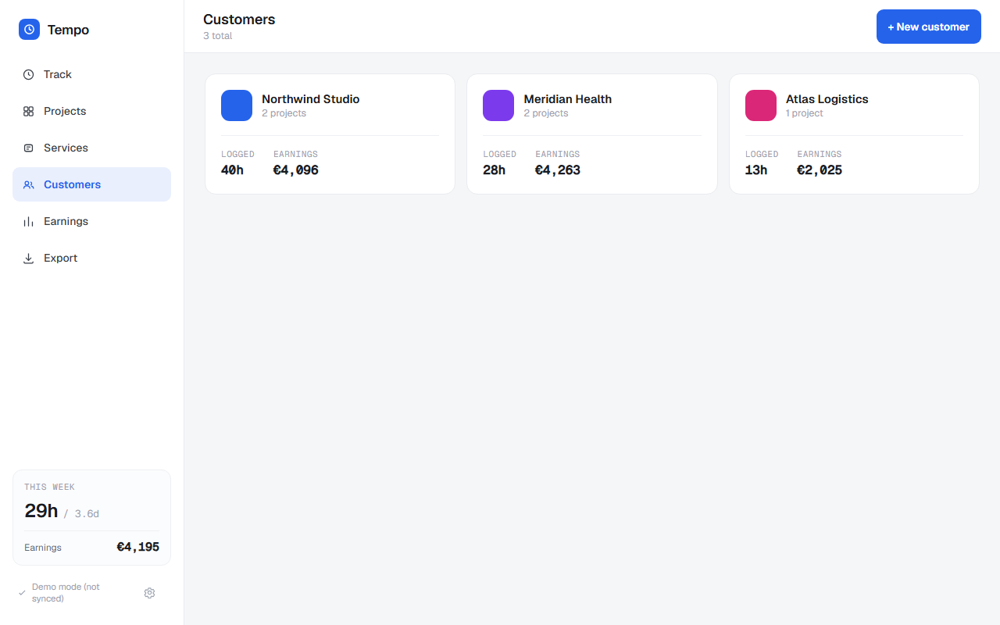
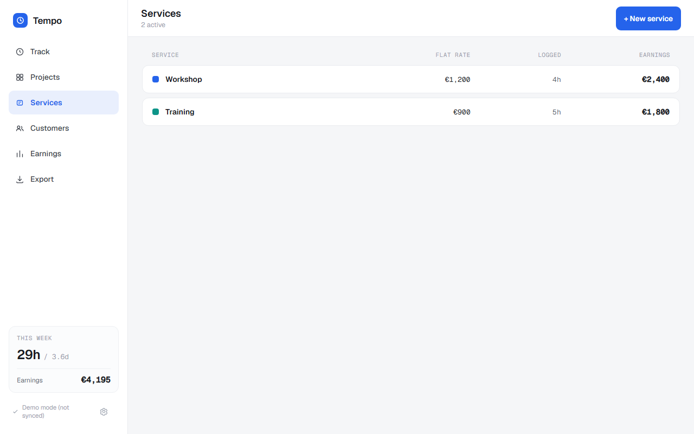
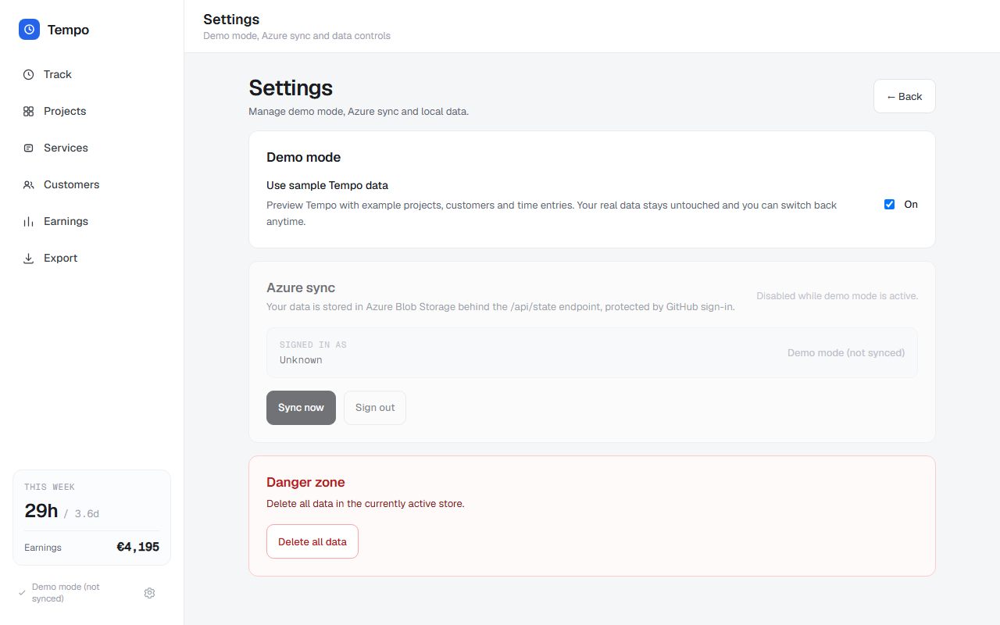
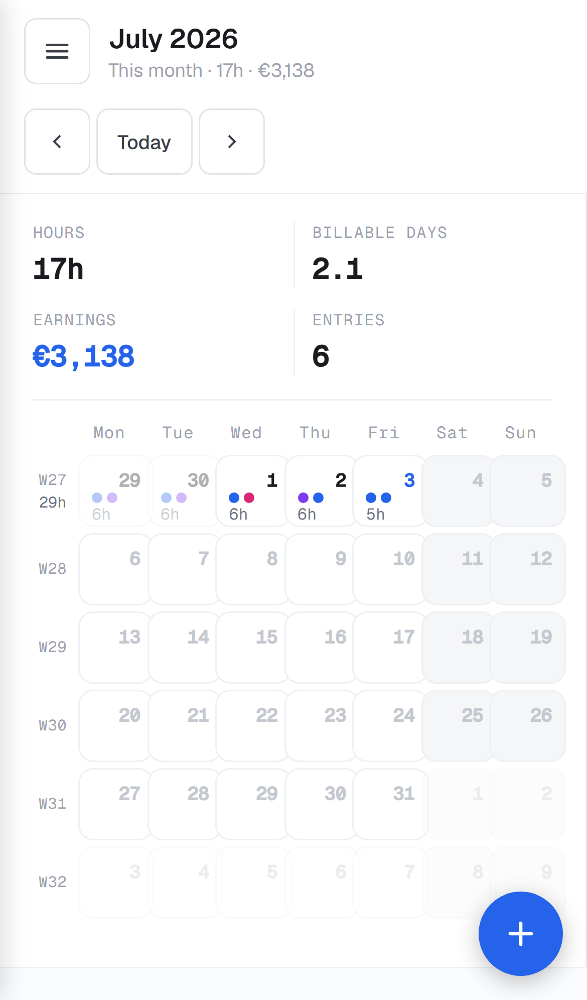
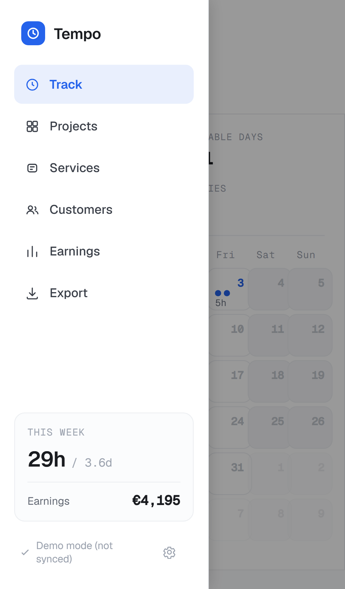
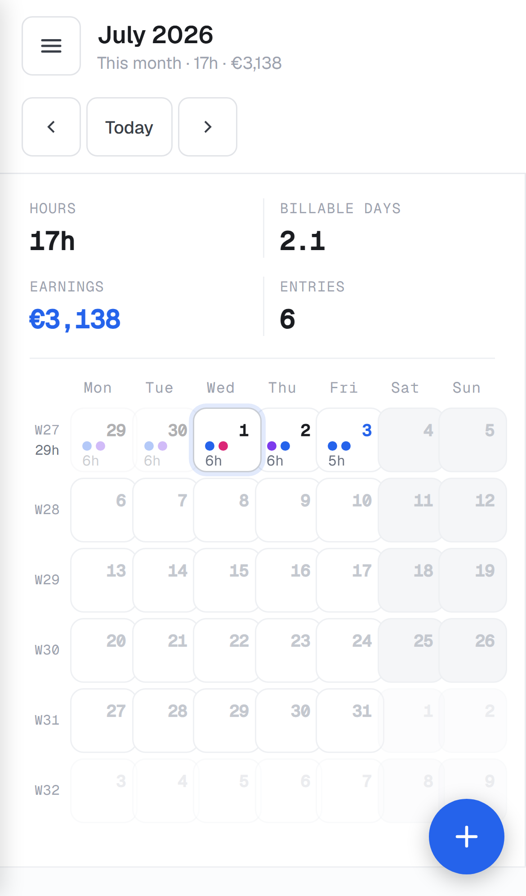

# Tempo

A personal time-tracking app for freelancers and independent consultants. Log hours to projects and customers, track day-rate earnings, book flat-fee services, and generate branded PDF timesheets — all in a single-page app hosted on Azure.

> **Try it first** — open Settings (gear icon) and toggle **Demo mode** to explore the app with realistic fictional data, no account needed.

---

## Screenshots

### Desktop

| Track | Day detail | Projects |
|---|---|---|
|  |  |  |

| Customers | Services | Settings |
|---|---|---|
|  |  |  |

### Mobile

| Calendar | Drawer | Day detail |
|---|---|---|
|  |  |  |

---

## Features

- **Monthly calendar** — colour-coded day cells with hour labels and coloured pips per project; click any day to open the detail panel
- **Projects** — link each project to a customer, set a day rate (or multiple rate periods), and see total logged hours + earnings per project
- **Services** — fixed-rate bookings (workshops, training, etc.) charged at a flat per-session rate
- **Customers** — group projects under customers with a colour identity; per-customer earnings and project summaries
- **Earnings view** — filter by customer, project, or service; choose month/quarter/year or a custom range; bar chart breakdown
- **Timesheet export** — generate a branded PDF timesheet and a zip of all attachments for a customer or project, entirely client-side (no round-trip to the server)
- **Azure Blob Storage sync** — full state stored as one JSON blob; optimistic concurrency via ETags so two browser tabs never silently overwrite each other
- **File attachments** — attach receipts or documents to any time entry; files are stored in Azure Blob Storage and downloaded via short-lived SAS URLs
- **Demo mode** — explore a full week of fictional demo data without touching your real data; switch back at any time from Settings
- **Responsive mobile layout** — full-width calendar with collapsible drawer navigation and a floating action button for quick entry

---

## Architecture

```
Browser (React 19 + TypeScript + Vite SPA)
  │
  ├── /.auth/login/github   GitHub sign-in via Azure SWA built-in auth
  │
  ├── /api/state            GET / PUT — full state as one JSON blob (ETag concurrency)
  └── /api/attachments      POST (SAS upload ticket) / GET (SAS download URL) / DELETE
          │
          Azure Functions (Node 22, managed, co-hosted with SWA)
          │
          Azure Blob Storage
            ├── container: state        (tempo.json — the whole data model)
            └── container: attachments  (<entryId>/<attachmentId>)
```

**Auth**: Every route (`/*` and `/api/*`) is gated behind the `owner` role in `staticwebapp.config.json`. The GitHub identity you invite gets that role via `az staticwebapp users invite`. Unauthenticated visitors are redirected straight to the GitHub login page.

---

## Self-hosting on Azure

Tempo is designed to be hosted by a single user. The entire stack runs on Azure services with a generous free tier.

### 1 — Prerequisites

- [Azure CLI](https://learn.microsoft.com/en-us/cli/azure/install-azure-cli) installed and signed in (`az login`)
- A GitHub account (used for authentication)
- This repository forked to your own GitHub account

### 2 — Create the storage account

```bash
# Create a resource group (pick any region)
az group create --name rg-tempo --location westeurope

# Create a storage account (name must be globally unique, 3-24 lowercase chars)
az storage account create \
  --name <your-storage-account> \
  --resource-group rg-tempo \
  --sku Standard_LRS \
  --kind StorageV2

# Create the two containers
az storage container create --name state       --account-name <your-storage-account>
az storage container create --name attachments --account-name <your-storage-account>
```

### 3 — Create the Static Web App

```bash
az staticwebapp create \
  --name tempo-app \
  --resource-group rg-tempo \
  --location westeurope \
  --sku Free \
  --source https://github.com/<your-github-username>/tempo \
  --branch main \
  --app-location / \
  --api-location api \
  --output-location dist \
  --login-with-github
```

The CLI will open a browser window for GitHub authorisation and add the `AZURE_STATIC_WEB_APPS_API_TOKEN` deployment secret to your fork automatically.

### 4 — Configure app settings

Retrieve your storage account key:

```bash
az storage account keys list \
  --account-name <your-storage-account> \
  --resource-group rg-tempo \
  --query "[0].value" -o tsv
```

Set the required application settings on the Functions runtime:

```bash
az staticwebapp appsettings set \
  --name tempo-app \
  --resource-group rg-tempo \
  --setting-names \
    TEMPO_STORAGE_ACCOUNT_NAME=<your-storage-account> \
    TEMPO_STORAGE_ACCOUNT_KEY=<key-from-above> \
    TEMPO_STATE_CONTAINER=state \
    TEMPO_ATTACHMENTS_CONTAINER=attachments
```

### 5 — Invite yourself as owner

Look up your GitHub identity in the SWA user list (sign in once first so your identity appears):

```bash
az staticwebapp users list --name tempo-app --resource-group rg-tempo -o table
```

Then assign the `owner` role to your identity:

```bash
az staticwebapp users update \
  --name tempo-app \
  --resource-group rg-tempo \
  --user-details <your-github-username> \
  --authentication-provider GitHub \
  --roles owner
```

> **Note:** The `owner` role is a custom role defined in `staticwebapp.config.json`. It is separate from the Standard-plan password-protection feature — the Free tier supports it via the `az staticwebapp users` commands above.

### 6 — Enable CORS on blob storage (for attachment downloads)

The timesheet export downloads attachment files directly from Blob Storage in the browser. Add a CORS rule so the request isn't blocked:

```bash
az storage cors add \
  --account-name <your-storage-account> \
  --services b \
  --methods GET HEAD \
  --origins "https://<your-swa-hostname>.azurestaticapps.net" \
  --allowed-headers "*" \
  --exposed-headers "*" \
  --max-age 3600
```

Replace `<your-swa-hostname>` with the auto-generated hostname shown by:

```bash
az staticwebapp show --name tempo-app --resource-group rg-tempo --query defaultHostname -o tsv
```

If you add a custom domain later, run the command again for that origin.

### 7 — Deploy

Push to `main` — the GitHub Actions workflow (`.github/workflows/deploy.yml`) builds and deploys automatically. The app will be live at the URL from step 6 within a few minutes.

---

## Local development

```bash
# Install frontend dependencies
npm install

# Install API dependencies
cd api && npm install && cd ..

# Copy API settings for local Azurite / emulator use
cp api/local.settings.json.example api/local.settings.json
# Edit local.settings.json if you want to point at real Azure storage instead of Azurite

# Start Azurite (Azure Storage emulator) in a separate terminal
npx azurite --silent --location .azurite

# Start the API (in a separate terminal)
cd api && npm run watch

# Start the frontend dev server
npm run dev
```

The frontend runs at `http://localhost:5173`. Because there is no SWA auth proxy locally, set `TEMPO_SKIP_AUTH_CHECK=1` in `api/local.settings.json` — the API will synthesise a dummy owner identity so all endpoints work without a real GitHub sign-in.

```jsonc
// api/local.settings.json
{
  "Values": {
    ...
    "TEMPO_SKIP_AUTH_CHECK": "1"
  }
}
```

### Commands

| Command | Description |
|---|---|
| `npm run dev` | Start Vite dev server |
| `npm run build` | Production build (`tsc -b && vite build`) |
| `npm run lint` | Run oxlint |
| `npx tsc -b` | Type-check frontend |
| `npx vitest run` | Run unit tests |
| `npm run test:e2e` | Run Playwright end-to-end tests |
| `cd api && npx tsc -p tsconfig.json` | Type-check the API |
